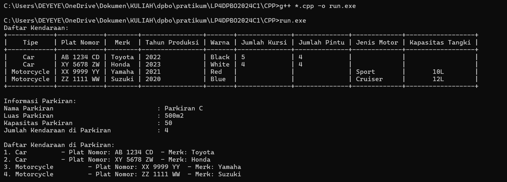
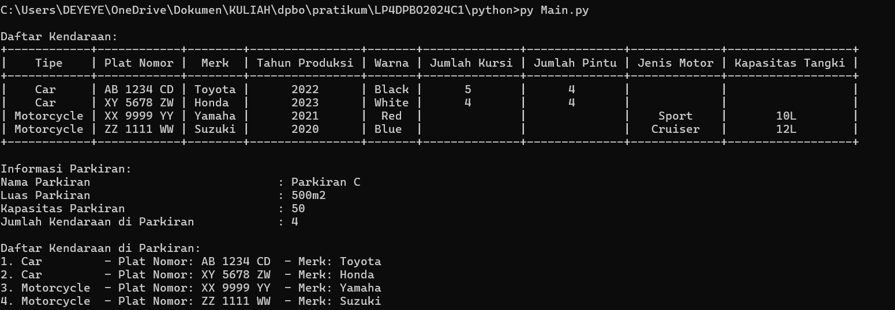

# Janji
Saya Septiani Eka Putri NIM 2206000 mengerjakan Latihan Praktikum 4 dalam mata kuliah Desain dan Pemrograman Berorientasi Objek untuk keberkahanNya maka saya tidak melakukan kecurangan seperti yang telah dispesifikasikan. Aamiin

## Desain Program 
Terdiri dari 5 class yaitu **Vehicle**, **Car**, **Motorcycle**, **Garage**, dan **Parkinglot**.

### Diagram

Dalam class **Vehicle** memiliki 4 atribut, yaitu :
* Plat Nomor
* Merk
* Tahun Produksi
* Warna

Dalam class **car** memiliki 2 atribut, yaitu :
* Jumlah Kursi
* Jumlah Pintu

Dalam class **Motorcycle** memiliki 2 atribut, yaitu :
* Jenis Motor
* Kapasitas Tangki

Dalam class **Garage** memiliki 3 atribut, yaitu :
* Nama Garasi
* Luas Garasi
* Daftar Kendaraan

Dalam class **Parkinglot** memiliki 2 atribut, yaitu:
* Kapasitas
* Jumlah kendaraan saat ini

## Alur Progran
### Relasi antar class
* Dalam program ini Car dan Motorcycle merupakan extends dari Vehicle. Dan Parkinglot merupaka extend dari Garage.
* Selanjutnya class Garage dan vehicle memiliki hubungan composite. Dimana class Garage mengandung atau menggunakan class Vehicle sebagai komponen atau anggota, dan ini diimplementasikan dengan cara garasi menyimpan daftar kendaraan. 

### Dokumentasi CPP

### Dokumentasi Python
